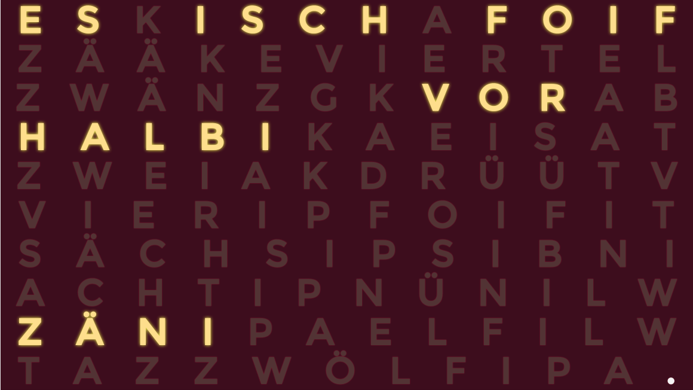

Zyt - get the time in words
===========================

> "Zyt" shows the time in words on a nice customizable display.

"Zyt" is the Swiss German word for time, and this is exactly what this app / web site is about:
_Zyt_ is a app showing the actual time as it is spoken - 03:45 becomes "a quarter to four".

Features
-----------

* Available on the web and as Mobile App
* Shows the time in words in different languages. Supported languages for now (more translations are welcome!):
  * Züri-Düütsch - a Swiss German dialect around Zurich
  * Bern-Düütsch - a Swiss German dialect around Bern
  * Standard-Deutsch - German as learned in school
  * Standard English - English as learned in school
* Style the clock as you want:
  * Background color
  * Dimmed and active Foreground text color and shadow
  * Font family
* Keep screen on if you want to use the clock as wall panel

Some screens:




Embed it into your web page!
----------------------------

Use the clock on your own web site with the following HTML snippet:

```html
<iframe src="http://zyt.alexi.ch/" width="800" height="600" style="border:none" ></iframe>
```

### Snippet parameters

You can use URL parameters to style the embedded clock. An example:

```html
<iframe src="http://zyt.alexi.ch/?bgColor=%23990000&fgActiveColor=%23ff0000&activeShadowColor=rgba(55,255,0,0.8)" width="400" height="300" style="border:none" ></iframe>
```

generates:

<iframe src="http://zyt.alexi.ch/?bgColor=%23990000&fgActiveColor=%23ff0000&activeShadowColor=rgba(55,255,0,0.8)" width="400" height="300" style="border:none" ></iframe>


*NOTE* that you have to URL-encode CSS Color values in the form `#aabbcc` to `%23aabbcc` to form a correct url.

The clock knows the following parameters:

* `bgColor`: Background color (css value), e.g. `%23000000`, or `rgb(0,0,0)`
* fgDimmedColor: foreground color for inactive chars (css value), e.g. `%23000000`, or `rgb(0,0,0)`
* `fgActiveColor`: foreground color for active chars (css value), e.g. `%23000000`, or `rgb(0,0,0)`
* `activeShadowX`: active char's X shadow offset, integer, e.g. `3`
* `activeShadowY`: active char's Y shadow offset, integer, e.g. `3`
* `activeShadowBlur`: active char's blur value, integer, e.g. `5`
* `activeShadowColor`: active char's shadow color (css value), e.g. `%23000000`, or `rgb(0,0,0)`
* `dimmedShadowX`: dimmed char's X shadow offset, integer, e.g. `3`
* `dimmedShadowY`: dimmed char's Y shadow offset, integer, e.g. `3`
* `dimmedShadowBlur`: dimmed char's blur value, integer, e.g. `5`
* `dimmedShadowColor`: dimmed char's shadow color (css value), e.g. `%23000000`, or `rgb(0,0,0)`
* `lang`: 'zueri': clock language. Supported at the moment:
  * `zueri`: Swiss German dialect around Zurich
  * `bern`: Swiss German dialect around Bern
  * `deutsch_std`: German
  * `english_std`: English
* `fontFamily`: The CSS Font family name, including the following embedded ones (Note to url-encode spaces `%20`):
  * Bree Serif
  * Libre Baskerville
  * Monoton
  * Montserrat
  * Roboto Mono
  * Ultra
* `upperCase`: Set `upperCase=1` to have upper cased characters, `upperCase=` (no value) for lower case chars
* `disableSettings`: Set `disableSettings=1` to disable the style menu functionality. Useful if you use it as web site widget.

Dev
---

* `npm install`
* `grunt`

Build Web
---------

* `npm install`
* `grunt build:web`
* Output goes to `build/` folder

Build App
---------

* `npm install`
* `grunt build:app`
* `cordova prepare`
* `ANDROID_HOME=/path/to/android/sdk cordova build android`
* `cordova build ios`


Build icons
-----------
ios:
`$ for size in 180 60 120 76 152 40 80 57 114 72 144 29 58 87 50 100 167; do convert icon-ios-1024.png -resize ${size} ios-icons/icon-ios-${size}.png; done`

Splash screens:
`$ for size in 320x480 640x960 768x1024 1536x2048 1024x768 2048x1536 640x1136 750x1334 1242x2208 2208x1242; do convert ios-icons/splash.png -resize ${size}\! ios-icons/splash-${size}.png;done`


android:
`$ for size in 36 48 72 96 144 192; do convert icon-512.png -resize ${size} android-icons/icon-andoid-${size}.png; done`

Font download
-------------

All fonts are from Google Fonts. To make Web Font download easier, I used this site:

http://www.localfont.com/

Used libraries
--------------

The color picker used is jscolor: http://jscolor.com/
