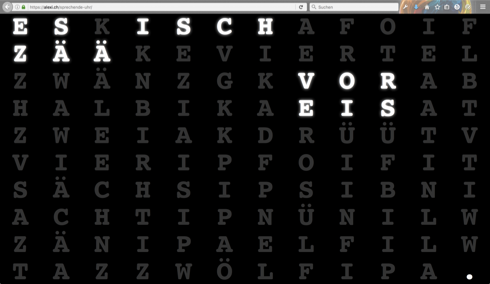

Zyt - get the time in words
===========================

> "Zyt" shows the time in words on a nice customizable display.

"Zyt" is the Swiss German word for time, and this is exactly what this app / web site is about:
_Zyt_ is a app showing the actual time as it is spoken - 03:45 becomes "a quarter to four".

Features
-----------

* Available on the web and as Mobile App
* Shows the time in words in different languages. Supported languages for now (more translations are welcome!):
  * Züri-Düütsch - a Swiss German dialect around Zurich
  * Bern-Düütsch - a Swiss German dialect around Bern
  * Standard-Deutsch - German as learned in school
  * Standard English - English as learned in school

A screenshot:

Dev
---

* `npm install`
* `grunt`

Build Web
---------

* `npm install`
* `grunt build:prod`

Build App
---------

* `npm install`
* `grunt build:prod`
* `ANDROID_HOME=/path/to/android/sdk cordova build android`
* `cordova build ios`

