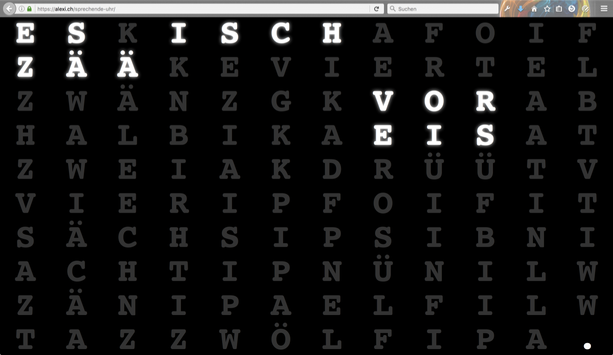
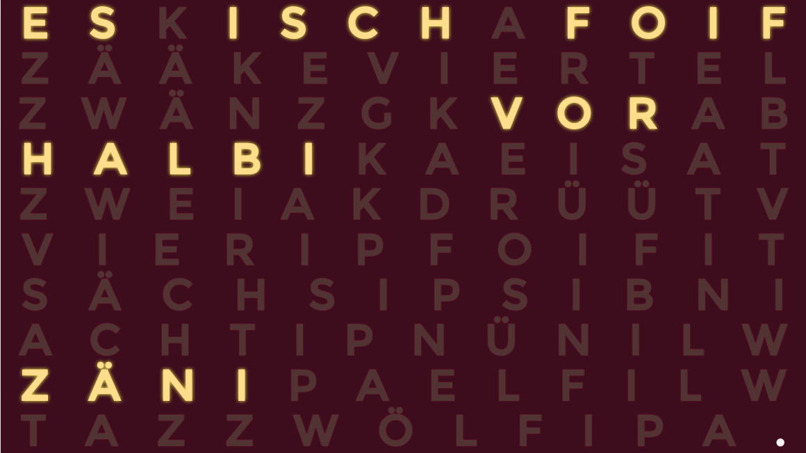

# Zyt - get a stylish clock that print words

> "Zyt" shows the time in words on a nice customizable display.

"Zyt" is the Swiss German word for _time_, and this is exactly what this app / web site is about:
_Zyt_ is a app showing the actual time as it is spoken - 03:45 becomes "a quarter to four".

Features
-----------

* Available on the web and as JS Library
* Shows the time in words in different languages. Supported languages for now (more translations are welcome!):
  * Züri-Düütsch - a Swiss German dialect around Zurich
  * Bern-Düütsch - a Swiss German dialect around Bern
  * Standard-Deutsch - German as learned in school
  * Standard English - English as learned in school
* Style the clock as you want:
  * Background color / gradient
  * Dimmed and active Foreground text color and shadow
  * Font family
* Keep screen on if you want to use the clock as wall panel
* Embed it into your web page via snippet code
* Create a link to your customized clock

Some screens:




## Configure your own clock

Head to <https://zyt.alexi.ch/> and click in the clock to configure your own clock. The settigs are
stored in your browser's local storage. You can even generate a link (in the settings panel) with all the
settings to share your clock with other people.


## Embed it into your web page!

Use the clock on your own web site with the following HTML snippet:

```html
<iframe src="https://zyt.alexi.ch/" width="800" height="600" style="border:none" ></iframe>
```

### Snippet parameters

You can use URL parameters to style the embedded clock. An example:

```html
<iframe src="https://zyt.alexi.ch/?bgColor1=%23990000&fgActiveColor=%23ff0000&activeShadowColor=rgba(55,255,0,0.8)" width="400" height="300" style="border:none" ></iframe>
```
generates:

<iframe src="https://zyt.alexi.ch/?bgColor1=%23990000&fgActiveColor=%23ff0000&activeShadowColor=rgba(55,255,0,0.8)" width="400" height="300" style="border:none" ></iframe>


*NOTE* that you have to URL-encode CSS Color values in the form `#aabbcc` to `%23aabbcc` to form a correct url.

The easiest way is to generate a Link via the settings panel.

## Use the clock as a JS library

// TODO

The clock knows the following parameters:

* `bgColor1`: Background color 1 (css value), e.g. `%23000000`, or `rgb(0,0,0)`, of the background gradient
* `bgColor2`: Background color (css value), e.g. `%23000000`, or `rgb(0,0,0)`, of the background gradient
* `bgAngle`: Background gradient's angle in degrees, e.g. `90`
* `fgDimmedColor`: foreground color for inactive chars (css value), e.g. `%23000000`, or `rgb(0,0,0)`
* `fgDimmedOpacity`: inactive char's opacity, from 0 (= fully transparent) to 1 (= fully opaque)
* `fgActiveColor`: foreground color for active chars (css value), e.g. `%23000000`, or `rgb(0,0,0)`
* `fgActiveOpacity`: active char's opacity, from 0 (= fully transparent) to 1 (= fully opaque)
* `activeShadowX`: active char's X shadow offset, integer, e.g. `3`
* `activeShadowY`: active char's Y shadow offset, integer, e.g. `3`
* `activeShadowBlur`: active char's blur value, integer, e.g. `5`
* `activeShadowColor`: active char's shadow color (css value), e.g. `%23000000`, or `rgb(0,0,0)`
* `dimmedShadowX`: dimmed char's X shadow offset, integer, e.g. `3`
* `dimmedShadowY`: dimmed char's Y shadow offset, integer, e.g. `3`
* `dimmedShadowBlur`: dimmed char's blur value, integer, e.g. `5`
* `dimmedShadowColor`: dimmed char's shadow color (css value), e.g. `%23000000`, or `rgb(0,0,0)`
* `lang`: 'zueri': clock language. Supported at the moment:
  * `zueri`: Swiss German dialect around Zurich
  * `bern`: Swiss German dialect around Bern
  * `deutsch_std`: German
  * `english_std`: English
* `fontFamily`: The CSS Font family name, including the following embedded ones (Note to url-encode spaces `%20`):
  * Audiowide
  * Black Ops One
  * Bree Serif
  * Bungee Inline
  * Crushed
  * Faster One
  * Libre Baskerville
  * Macondo Swash Caps
  * Merienda One
  * Monoton
  * Montserrat
  * Roboto Mono
  * Spicy Rice
  * Stardos Stencil
  * Syncopate
  * Ubuntu
  * Ultra
  * Wallpoet
* `upperCase`: Set `upperCase=1` to have upper cased characters, `upperCase=` (no value) for lower case chars
* `disableSettings`: Set `disableSettings=1` to disable the style menu functionality. Useful if you use it as web site widget.
* `clickUrl`: Set `clickUrl` to a web site (e.g. `clickUrl=https://zyt.alexi.ch`) to open the link instead of the settings dialog. Overrides `disableSettings`.

## Dev

### Build/watch the (dev) library

* `npm install`
* `npm run watch`

builds the lib to `dist/`

### Build the prod library

* `npm install`
* `npm run build`

builds the dist lib to `dist/`


### Build site for zyt.alexi.ch

* `npm install`
* `npm run build-site`
* Output goes to `zyt.alexi.ch-site/` folder

### build and publish npm package

// TODO


Font download
-------------

All fonts are from Google Fonts. To make Web Font download easier, I used this site:


# TODO

* style the settings panel
* ~~export json params~~
* (re-)implement `clickUrl` parameter
* (re-)implement screen keep-on, using Web API
* use free fonts - not sure if google fonts are free to embed
* choose different zime zone relative to the actual one
* update actual zyt.alexi.ch with new version
* zyt.alexi.ch: support url parameters as before